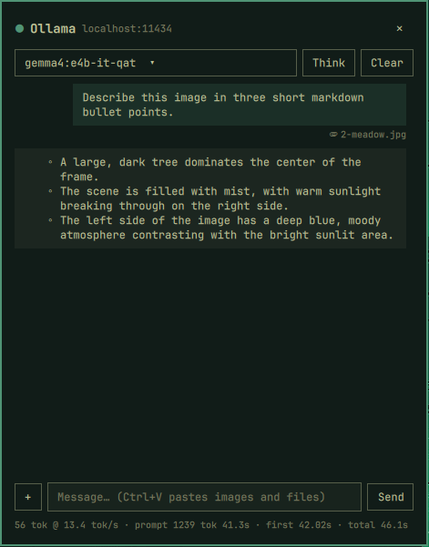

# Ollama Chat

An [Omarchy](https://omarchy.org/) bar widget for testing an [Ollama](https://ollama.com/) server: click the
llama icon for a chat panel with a model picker, streamed replies and per-reply speed stats.

- **Sticky panel**: it's its own layer-shell window, so it stays open while you use other windows. The icon,
  the ✕ or Esc closes it. Click the panel to type in it again.
- **Model picker** from `/api/tags`, showing size, quantization and which model is currently loaded.
- **Streamed replies** from `/api/chat`, rendered as markdown. **Think** toggle for models with the thinking
  capability (the reasoning shows in italics above the reply). **Stop** and **Clear**.
- **Attachments**: Ctrl+V (or Omarchy's Super+V) pastes a screenshot/image or files copied in a file manager;
  `+` opens the desktop file chooser. Images go to the model's vision input; text files and PDFs (via
  `pdftotext`) are added to the message, up to 100k characters each.
- **Stats** after each reply: tokens and tok/s, prompt tokens and time, time to first token, load time, total.
- Click any message to copy it.
- The icon dims when the server is unreachable (checked every 30 s) and takes the accent colour while a reply
  is streaming. Right-click refreshes the model list.

## Install

```bash
omarchy plugin add https://github.com/jchisholm59/omarchy-ollama-chat.git --enable
```

Needs `curl`, `jq`, `wl-clipboard` and `poppler` (for `pdftotext`), all part of a stock Omarchy install, plus an
Ollama server somewhere on your network (or on this machine). No sudo or system changes; everything lives in
the plugin folder and `~/.config/ollama-chat/`.

<p></p>

## Remove

```bash
omarchy plugin remove jim.ollama-chat
rm -rf ~/.config/ollama-chat     # optional: saved host, model and prompt
```

## Configure

Settings live in `~/.config/ollama-chat/state.json` (created on first use; the panel also stores the last
model and the Think toggle there):

```json
{
  "host": "http://192.168.1.50:11434",
  "systemPrompt": "..."
}
```

- `host`: your Ollama server. Defaults to `http://localhost:11434` (Ollama on this machine); set it to reach
  one elsewhere on the network.
- `systemPrompt`: sent as a hidden first message. The default tells the model what it is (`{model}`, `{size}`,
  `{quant}`) and that it runs locally on `{host}`, because models can't know that and otherwise claim to be in
  the cloud. Set your own (e.g. to name the machine it runs on) or `""` to send none.

Reload after editing the file by hand: `omarchy-shell shell rescanPlugins`.

## Scripting

The panel registers an IPC target, so it can be driven from keybindings or scripts:

```bash
omarchy-shell jim.ollama-chat toggle                  # also open / close
omarchy-shell jim.ollama-chat ask "why is the sky blue?"
omarchy-shell jim.ollama-chat attach ~/Pictures/x.png
```

For example, in `~/.config/hypr/bindings.conf`:
`bind = SUPER ALT, O, exec, omarchy-shell jim.ollama-chat toggle`

## Files

- `BarWidget.qml`: the bar icon, the panel and all the chat logic.
- `bin/ollama-chat-attach`: turns files into attachments (JSON lines: image as base64, text, or an error).
- `bin/ollama-chat-paste`: the Ctrl+V handler. Images and copied files become attachments; exits 3 for plain
  text so the field pastes normally.
- `assets/ollama.svg`: Ollama logo from [simple-icons](https://simpleicons.org/) (CC0), recoloured to the bar's
  foreground.
